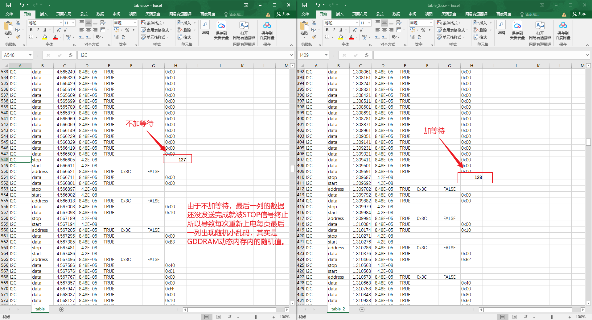
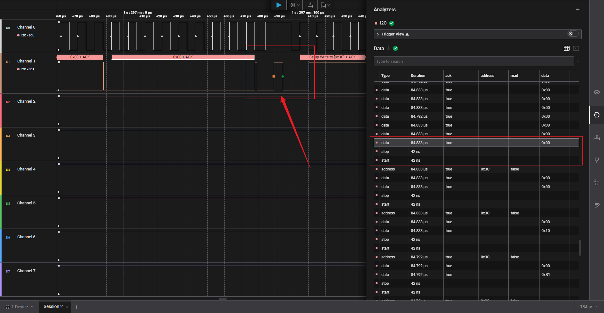

# 
项目说明

- 这次上传的项目终于对了🤭
- 本次学习的是`SSD1306`屏幕驱动芯片的使用
- 通过`STM32F103C8T6`与`SSD1306`使用`I2C`进行通讯
- 分别实现了如何`打印字符、打印字符串、打印BitMap图片、打印汉字字面量(UTF-8)`
- 项目开发环境: `VSCode、EIDE(VSCode扩展插件)、Keil uVision5`
- 烧录工具: `ST-Link V2`

## 2025.6.29 更新

- 今天为OLED屏幕驱动添加了`缓冲区`，方便批量修改屏幕内容然后快速刷新屏幕
- 一些图形绘制函数有点懒还没学习完，后面会补全
- 增加了`I2C1的DMA传输`，使用`DMA`搬运缓冲区数据，效率或许提升了(?)

## 2025.6.30 更新

- 今天用`Logic Analyzer`分析复现了一下原本的在`I2C1`的`DMA`传输中，`DMA`搬运数据时，由于数据还没完全传输完成，就过早发送STOP信号，导致最后一列数据没有有效发送到`SSD1306`中。
- 
- 
